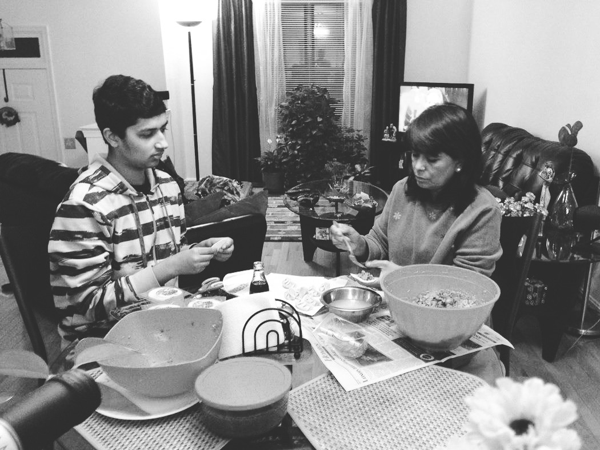

When people ask me if I cook, I usually reply with “I like to make Momos,” which is often followed by a curious look that immediately warrants details. Momos are steamed dumplings filled with meat or vegetables that are complemented with a spicy (if you’re doing it right) tomato-based sauce called Achaar (pronounced uh-char).

A brief history: originating in Tibet, where they were made with Yak meat, Momos were brought to the Kathmandu Valley by Newari merchants who traded with the north. It also spread to India, Bhutan, and other surrounding countries during the first two waves of the Tibetan diaspora.

Anyways, after explaining what a Momo is, the conversation forks in one or more directions depending on who I’m talking to. It’s always a light, funny conversation — I love it! So here’s what I talk about when I talk about making Momos: the process of making them, FaceTiming my mom for guidance, the spirit of team building, and putting Nepal on the map.

## The Process👨🏽‍🍳

Momos require patience and timing, and takes up an entire evening. The process consists of making the Achaar, preparing the stuffing, wrapping, and steaming. Here’s a rundown of how you can make your Momos:

### Making the Achaar

Cut tomatoes and Malguetta peppers, and cook them with minced garlic on vegetable oil until the tomatoes start to water down. Then, pour them into a blender with salt and chopped cilantro, and blend away. You should now have a savory brownish-red sauce. It’s pretty simple, just don’t let the blender launch the tomatoes all over your face — you’ll look like a crime scene, trust me.

### Preparing the stuffing

> Tip: Don’t be the person cutting the onion. That is always somebody else’s job. Scan the room for a victim and ask them to do it — with conviction. Don’t take no for an answer.

Mix the ground meat (or cabbage if you’re a vegetarian) with finely (this is bold for a reason: it’s important) chopped onions, cilantro, Garam Masala, turmeric, and salt. I mean really mix, like your life depends on this, like Gordon Ramsey has his palms around your innocent little face. I recommend using bare hands since they’re always more efficient. Oh, and melt a big bar of unsalted butter and mix it into this beautiful mess.

### Wrapping and steaming

This is when the Momos will come to life. Wet the outer linings of the wrapper skin, place the stuffing in the middle, and delicately (as much as you can) fold the skin by sticking the edges together. It can either turn out to be elegant or look like the back of a Stegosaurus; don’t stress, you’ll get better! Now, steam the wrapped dumplings in a double-decker steamer (ohhh, yeah!) for 14 minutes by switching the top and bottom tiers in seven.

## FaceTiming My Momma 👸🏽

Behind every successful man, there is a woman, and behind every successful batch of Momos, there is an angel patiently guiding a fool how to make them. That angel is my mom. Sitting cross-legged on a black leather couch behind a five-inch screen, my mom could be watching ‘Fixer Upper’ on HGTV, asking Alexa to bring her cheesecake, bickering with my dad about kitchen tiles, or intensely stalking Mark Zuckerberg on Facebook, but she decides to answer my call and help me prepare the stuffing for Momos — for the seventeenth time. Sometimes I’ll suggest adding a different spice and she’ll even tell me what an absolutely horrible idea that is. I love her!

## The Team Building 💪🏽

This is the best part. Everybody sits in a circle with the stuffing in the center, supplies of paper towels, bowls of water, stacks of dumpling wrappers, and a cheap-as-hell glass of wine. It’s like a little cult gathering inside a shabby little (because, Bay Area) apartment we like to call home.

At first, it’s fairly awkward and dysfunctional, because some people don’t know how to wrap the Momos properly while others are plowing through them. Then after the imbalance is mutually recognized, the veterans teach the noobs how much stuffing to use, how to wet the wrappers, and how to easily create their first decent-looking Momo.

After a while, the team is properly balanced and there is a strong momentum; the hands move rhythmically, the number of wasted wrapper skins due to a bad attempt decrease, the wrapped Momos are properly lined up on a large tray, and the self-confidence of individual members create a highly productive bubble. The once disorganized group of friends now becomes an incredibly well-oiled machine, thanks to the \$4 wine and a shared passion to have an exciting meal!

## Putting Nepal On The Map 🗺

Even though they originated in Tibet, Nepal produces and consumes the largest quantity of Momos in the world. It’s like pizza — born in Italy but consumed most (per capita) in Norway. The popularity of Momos in Nepal has led me to facetiously categorize them as a staple, which is when I get asked where I’m from.

Telling someone I’m from Nepal is the same as saying I’m from Jiraville, the response is almost always, “where is that?” The only difference is that the latter doesn’t exist. For this reason, us Nepali folks will grasp any reason to put our small, unnoticed homeland on the map. I bet you had to search Nepal on Google Maps just to be sure it was where you thought it was, and (honestly) that’s okay! It is, and should be, every Nepali person’s lifelong mission to inform and share the knowledge of our country.

That’s how we put Nepal on the map.
